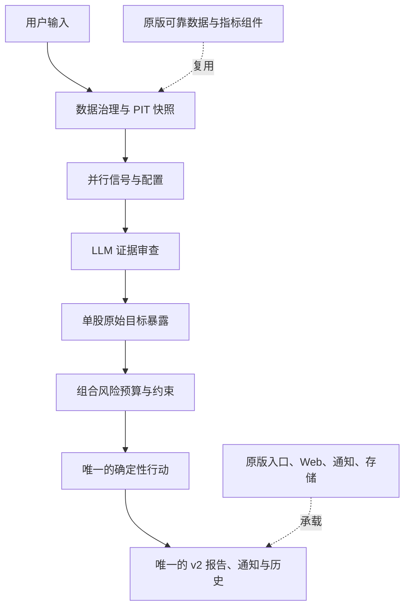
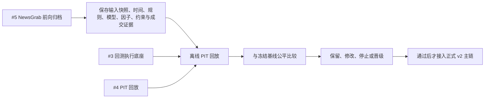
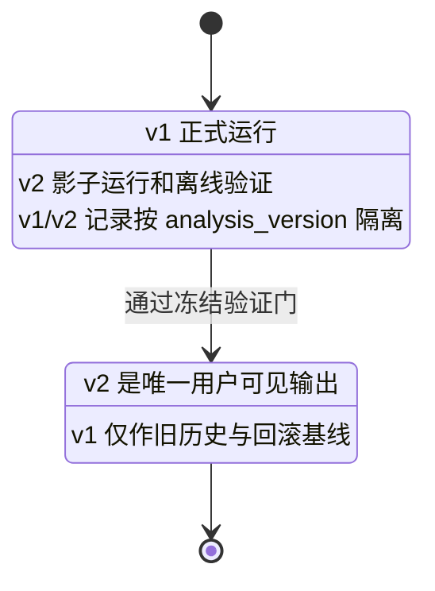

# DSA v2 目标架构与递进验证路线

> 状态：目标设计与递进验证路线；不构成收益承诺或自动交易授权。
>
> 执行边界：每日收盘评估、下一交易日开盘按规则成交；用户始终保留最终操作决定。

## 1. 最终目标：唯一的 v2 决策主链

DSA v2 的终态不是“v2 先分析、v1 再分析一次”，也不是两套结论拼进同一份报告。它是一个唯一的、版本化的日频组合决策主链；原版中可靠的行情接入、技术指标、Web、通知、数据库和报告基础设施可以复用，但旧的自然语言结论与默认决策规则不会在 v2 结论之后再次裁决。

```text
用户输入
  候选股票池 / 当前持仓 / 资金 / 风险偏好 / 投资期限
        ↓
数据治理与 PIT 快照
  日线、财务与估值、公告、NewsGrab 新闻归档、行业分类、宏观数据
        ↓
并行信号与配置层
  技术 T/C/R / 基本面 / Qlib / 事件情绪 / AI 受限因子选择 / 行业风格约束
        ↓
证据审查层
  LLM 汇总支持与反方证据、冲突和缺失；不直接决定仓位
        ↓
单股原始目标暴露
        ↓
组合风险预算与约束
        ↓
唯一的确定性行动与组合决策
  buy / add / hold / reduce / exit / watch；下一交易日计划
        ↓
唯一的 v2 网页、报告、通知与版本化决策留痕
```

自动 PIT 回放是贯穿上述链条的离线验证器，不是每次用户分析完成后额外再跑一套用户可见结论。它重放某历史决策日当时可得的输入、因子、状态、目标和下一交易日成交，用于检验能力是否可以晋级。

### 图 1：原版 DSA 到 v2 的逐层改造地图

| 原版 DSA | v2 修改后的目标架构 | 当前实施位置 |
|---|---|---|
| 用户输入：股票代码、自选股 | 候选池、当前持仓、资金、风险偏好、投资期限 | 后续产品输入层 |
| `main.py` / `server.py` / Web | 保留为统一入口与交付基础设施 | 保留，不在阶段 0 改写 |
| 数据提供层：行情、财务、新闻、行业 | 原数据源加数据治理与 PIT 快照：可得时间、历史成分股、公司行动、复权/现金账本、NewsGrab 前向归档 | 阶段 0A/0B 已建部分证据底座 |
| 技术、新闻、基本面分析 | 并行可计算信号：T/C/R、基本面、Qlib、事件因子、AI 受限因子选择、行业/风格配置 | 阶段 1A 已有研究基线；阶段 2 待实施 |
| LLM / Agent 综合意见 | 证据审查：支持、反方、冲突与缺失；不直接定仓位 | 后续受控改造 |
| 旧策略动作 / DecisionSignal | 单股目标暴露，再进入组合风险约束 | 阶段 0 的确定性执行底座已开始 |
| 报告、通知、历史 | 唯一 v2 行动、报告、通知与版本化留痕；v1 仅保留为旧历史/回滚基线 | 后续产品接管阶段 |

### 图 2：最终的每日 v2 决策链



图 2 中的原版组件是被复用的零件，不是 v2 结论之后的第二个分析器。正式用户输出只能来自 `唯一的确定性行动`。

## 2. 原版与 v2 的迁移关系

| 原版层 | v2 的处理方式 |
|---|---|
| `main.py`、`server.py`、API、Web、通知 | 作为入口和交付基础设施复用；最终承载唯一 v2 输出。 |
| 行情、财务、行业与新闻数据源 | 复用数据接入，但在进入 v2 决策前增加来源、版本、可得时间和 PIT 门。 |
| 技术指标与可计算风险纪律 | 作为可验证组件复用；不把原版自然语言策略直接视为已验证规则。 |
| 原版 LLM/Agent 综合结论 | 迁移期可作基线或影子对照；不在 v2 输出之后二次裁决。 |
| DecisionSignal、报告、历史记录 | 追加 `analysis_version`、规则/模型/输入快照版本；不得混合 v1/v2 内容。 |

迁移期允许 v1 继续服务、v2 影子运行并做离线对照。两者必须隔离保存：v1 是旧历史和回滚基线，v2 是研究/验收记录。只有通过预先冻结的验证门后，v2 才接管普通用户可见的报告、通知和历史；届时用户只看到一份 v2 结论。

### 图 3：横向贯穿的 PIT 验证与能力晋级线



这是一条横向质检线，不是每次网页分析末尾再产生一份用户可见结论。

### 图 4：迁移期与最终态的输出隔离



## 3. 数据治理与 NewsGrab

任何历史结论只能使用决策截止点前可得的信息。历史成分股、财报/公告可得日、公司行动、价格调整和现金账本均须显式记录；不能证明时点的数据只能降级为探索性研究。

NewsGrab 是独立的新闻采集服务。DSA 的实时 Agent 可通过既有 `GOOGLE_NEWS_COLLECTOR_URL` 调用它；阶段 0B 的前向归档使用同一个端点，但把每次结果保存为 DSA 自有的、不可覆盖的证据。归档记录请求、提交/完成/归档时间、文章发布时间精度、原始内容、错误和 SHA-256。它不修改当次实时报告，也不能补造接入日前未归档的历史新闻。

严格 PIT 新闻至少要求发布时间精确、发布时间不晚于决策截止点、且归档时间也不晚于该截止点。缺失、仅日期、无效或事后归档的新闻必须明确排除或降级。

## 4. 递进验证路线

每项能力均遵循同一顺序：冻结候选与评价规则 → 接入最小能力 → 自动 PIT 回放 → 与不含该能力的冻结基线比较 → 保留、修改或停止。

1. **阶段 0：PIT 与执行底座。** 统一下一交易日成交、成本、共享现金账本、输入快照和审计；0B 自接入日起积累前向新闻证据。
2. **阶段 1：数值基线。** 用相同股票池、数据口径、成本与执行规则比较固定技术/数值因子基线。
3. **阶段 2：AI 受限因子选择。** LLM 仅在冻结候选因子中删减、替换或增补；保存候选版本、窗口、提示词、模型、原始输出和解析结果。比较固定组、LLM 删减组、LLM 增补组与全候选组。
4. **阶段 3：事件/情绪因子。** LLM 只把已归档文本提取成有时间戳的结构化变量；确定性代码评分，不能直接下单。
5. **阶段 4：行业/风格约束。** 输出总风险、行业上限与风格暴露，不直接指定单股交易。
6. **阶段 5：组合风险预算。** 在单股目标之上加入集中度、相关性、波动、现金、换手与成本约束。
7. **阶段 6：产品接管。** 只有通过验证的能力才进入正式 v2 主链；保留用户确认，绝不自动下单。

统一评价至少包括成本后收益、最大回撤、有效窗口风险调整指标、覆盖率、换手、成本、未成交订单、现金比例和集中度。低回撤、低换手或高现金本身都不能单独证明投资效果改善。

当前已落地的 #3、#4、#5 都属于图 3 的底座与证据层；它们并不表示图 2 的完整 v2 主链已经接管原版日常分析。

## 5. 当前边界

- 当前阶段不改写 DSA 既有默认规则或历史结论。
- 当前 PR 的 PIT 与 NewsGrab 归档是可审计研究底座，不是 v2 已经接管生产编排的声明。
- 远程 LLM 不保证逐字重现；可重放至少要求保存其输出并可离线重演同一选择。
