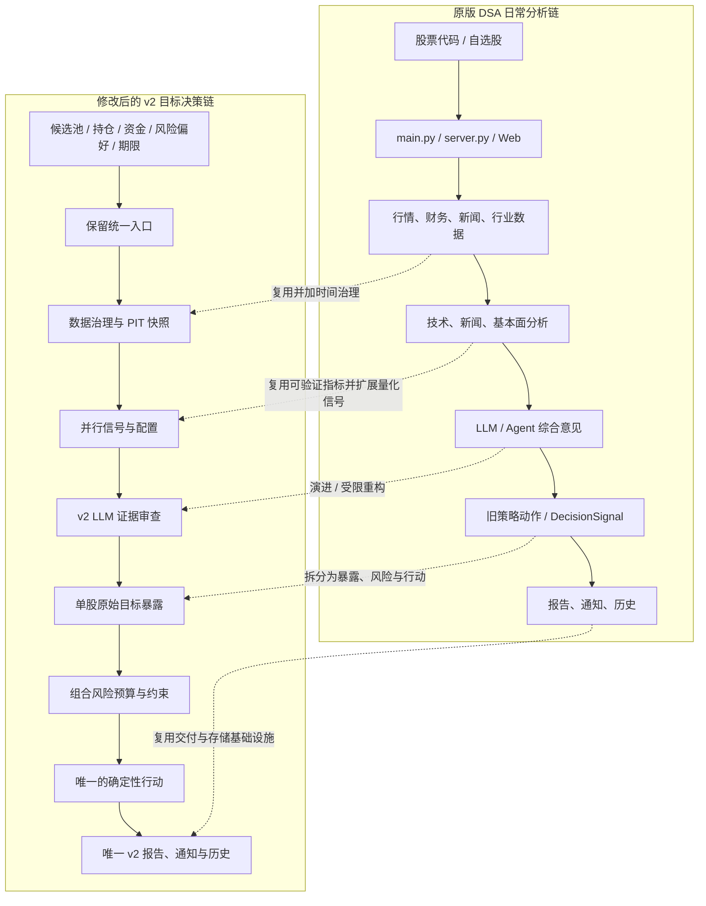
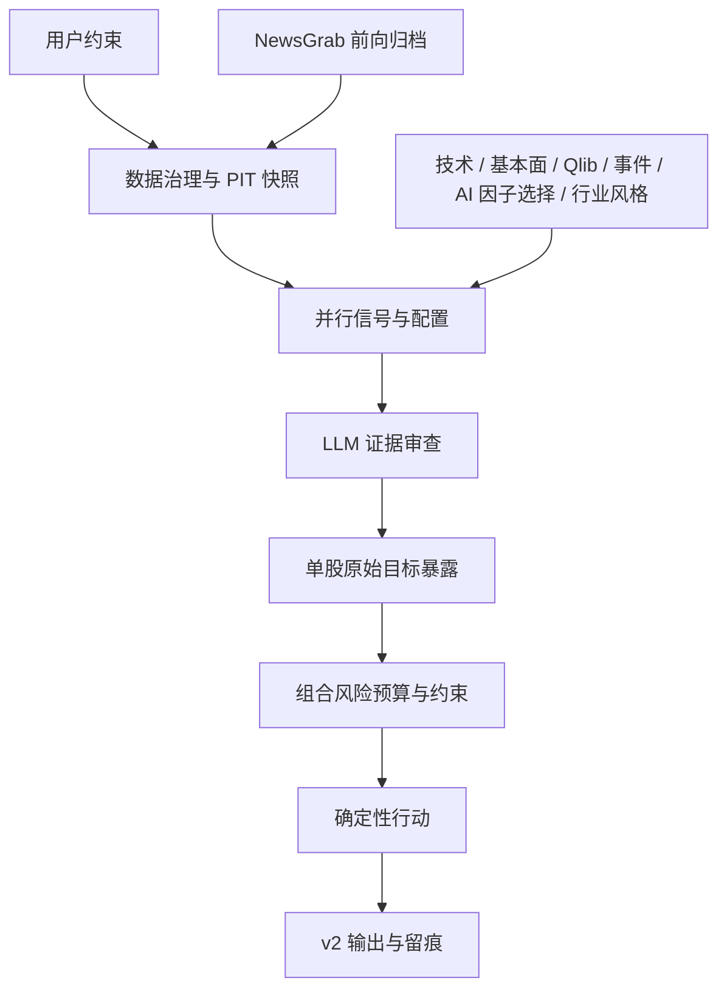
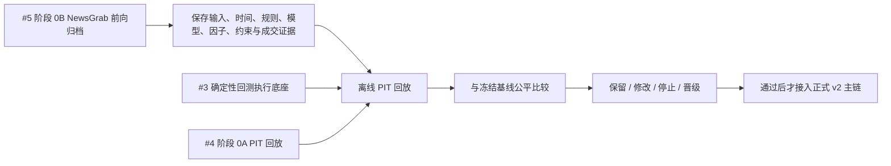
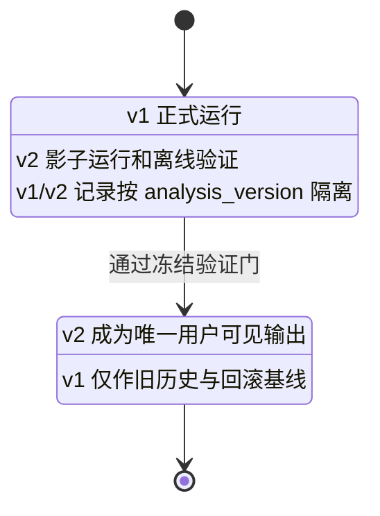

# DSA v2 目标产品架构与自动 PIT 验证路线

> 状态：未来目标设计（新范围），尚未进入实现或收益结论
>
> 生效边界：不改写 DSA v0.1 默认规则；不改写 v0.2 已冻结的 T/C/R 单模块实验与历史结果
>
> 决策频率：每日收盘评估，下一交易日开盘按需执行；系统不自动下单
>
> 核心路线：接入一项能力（Qlib、AI 因子选择、LLM 事件因子等）→ 自动 PIT 回放 → 与接入前基线比较 → 保留、修改或停止该能力

## 1. 目标与非目标

目标是在用户给定候选股票、资金、风险偏好、投资期限和当前持仓后，形成一份可复核的**日频组合决策计划**：何时观察、买入、加仓、持有、减仓或退出，以及每项行动的依据、风险和目标仓位。

该系统寻求“成本后、风险可接受的组合结果改善”，而不是保证收益、每天交易、以现金比例或低回撤单独充当成功证据。

本阶段不包括：

- 自动下单、分钟级交易、TWAP/VWAP 或高频执行；
- 由 LLM 自由决定买卖、仓位或行业权重；
- 为每只单独股票训练一套参数模型；
- 用未冻结的历史新闻、公告或修订后数据回填过去的判断。

## 2. 最终产品每日运行架构

```text
用户输入
  候选股票池 / 当前持仓 / 资金 / 风险偏好 / 投资期限
        ↓
数据治理与 PIT 快照
  日线、财务与估值、公告、NewsGrab 公司/行业/市场新闻快照、行业分类、宏观数据
        ↓
并行信号与配置层
  A. 技术状态：趋势、通道、波动、流动性（T/C/R）
  B. 基本面因子：质量、成长、估值、负债等
  C. LLM 事件/情绪因子：文本 → 时间戳明确的结构化变量
  D. Qlib 数值因子与横截面预测：股票相对排序、置信度、不确定性
  E. AI 因子选择：从已验证候选因子中选择或组合可计算特征
  F. 市场/行业/风格配置：总风险、行业上限、风格暴露指引
        ↓
证据审查层（LLM 辩论）
  汇总支持/反方证据、识别冲突与数据缺失；不直接生成仓位数字
        ↓
单股原始目标暴露
  方向许可 + 进场/持有/减仓/退出状态 + 因子分数
        ↓
组合风险预算与约束优化
  单股、行业、风格、相关性、波动、现金、换手和成本约束
        ↓
确定性行动与组合决策
  buy / add / hold / reduce / exit / watch；形成下一交易日计划
        ↓
网页展示、决策留痕与后验评价
  白话摘要 + 专业报告 + 输入、因子、状态、权重、订单、成交记录
        ↓
自动 PIT 回放与后验验证
```

这条链路描述的是产品的日常运行：每日重新评价，只有在目标仓位相对现有仓位出现足够变化且成本合理时才产生订单。它不是高频交易，也不要求每天都实际买卖。

自动 PIT 回放不是网页的下一步功能，而是与产品链路共用同一套模块的验证器：它把决策日期自动回拨到历史每一个交易日，重放当日输入、因子、状态、目标和 t+1 成交。

## 3. 模块职责、来源与处理方式

| 模块 | 解决的问题 | 输入 | 输出 | 来源与处理边界 |
|---|---|---|---|---|
| 用户与候选池 | 决定投资约束与可选范围 | 候选股、持仓、资金、风险、期限 | 可投资股票、风险档和限制 | 用户候选池决定最终可买范围；系统不擅自扩展为全市场选股 |
| PIT 数据治理 | 确保决策日只使用当时可见信息 | 价格、公告、财报、新闻、行业/宏观数据 | 有时间戳的数据快照、缺失标记 | 延续 v0.1 `decision_cutoff`；无法证明发布时间的数据不得进入历史结论 |
| NewsGrab 新闻适配器 | 自动采集可供事件/情绪分析的公司、行业和市场新闻 | 股票/行业/市场查询词、语言和地区 | 原始新闻快照、来源、URL、发布时间、抓取时间、内容哈希和采集质量 | 内部调用 NewsGrab 异步任务并由 DSA 自行持久化；NewsGrab 无状态，不能单独补齐过去未归档的历史新闻 |
| 技术状态 T/C/R | 管理进、持、减、退与风险缩放 | OHLCV | 状态、触发原因、原始执行目标 | 复用原版可计算技术指标与 v0.1 风险纪律；不把原版自然语言策略直接当作已验证规则 |
| 基本面因子 | 比较公司的质量、成长与估值 | 已披露财务/估值数据 | 数值因子、行业中性排名、数据时效 | 传统多因子路线；按公告可得日对齐，避免财报未来函数 |
| LLM 事件/情绪因子 | 将非结构化文本转成可验证变量 | 公告、新闻、电话会议等 | 事件类型、对象、方向、强度、时效、置信度、原文证据 | LLM 只提取与归类；确定性代码将其转为分数；优先从时间边界更可靠的公告开始 |
| Qlib 因子/预测 | 估计候选股间相对预期与不确定性 | 同一冻结数据上的数值与事件因子 | `alpha_score`、排名、预测不确定性、研究回测 | Qlib 是量化模型与研究层，不是收益保证或第二套独立行情真源；接入后由自动 PIT 回放验证 |
| AI 因子选择 | 从候选因子中筛选、组合或提出可复算的新因子 | 已冻结的候选因子、训练/验证数据 | 被选因子、组合方式、版本和理由 | AI 不能输出不可复算的主观因子；其效果必须与 Qlib 固定因子基线自动比较 |
| 市场/行业/风格配置 | 决定组合优先承受哪类风险 | 宏观状态、行业相对强弱、行业事件聚合、风格因子 | 股票总风险上限、行业上下限、风格暴露约束及有效期 | 自上而下配置约束，不直接指定单股买卖；宏观信息因滞后与修订风险，默认低频更新 |
| LLM 辩论 | 检查证据冲突、反方风险与数据质量 | 上述模块的结构化输出和证据 | 支持/反方摘要、风险标记、缺失说明 | 延续 v0.1 “LLM 不越权”；如需影响数值，只能触发预登记的确定性降级规则 |
| 单股目标暴露 | 将可投资性与执行状态变成单股意愿 | 方向、因子、状态、风险标记 | 每股原始目标权重与理由 | `Buy` 是做多许可，不等于立即满仓；`Sell` 是硬退出 |
| 风险预算 | 将多只股票意愿变成可承受组合 | 原始目标、波动、相关性、行业/风格约束、用户风险 | 最终权重、现金、约束命中与缩放原因 | 主要控制集中度而非制造 Alpha；先用可解释约束，后比较复杂优化器 |
| 行动与展示 | 形成用户可审阅的计划 | 最终权重与现有仓位 | 行动、订单计划、白话/专业解释 | 每日重新评估，只有目标与现有仓位差异足够大且成本合理才产生交易 |

## 4. 行业与风格配置层

行业/风格层回答“风险优先给谁”，区别于单股因子回答“同类股票中谁更好”，也区别于风险预算回答“最后给多少”。

它的标准输出必须是可执行约束，而不是“看好某行业”的自然语言。例如：

| 输出类型 | 示例 |
|---|---|
| 总股票风险 | 股票总暴露不超过 70% |
| 行业上限 | 消费不超过 30%，新能源不超过 20% |
| 行业倾向 | 消费允许超配；新能源中性；高估值成长限制低配 |
| 风格约束 | 高波动成长股合计不超过 25%；质量/低波动风格正常配置 |
| 生效周期 | 月度例行更新；重大、可证明时间的事件才触发临时复核 |

行业/风格分数由宏观状态、行业相对动量/估值/盈利变化、行业事件聚合和数值模型共同形成，再由冻结映射转为上限和下限。LLM 可以汇总政策、供需或行业公告的影响对象与证据，不能直接决定上限数值。

研究股票池与用户候选池必须区分：前者覆盖多个行业，用于估计行业与风格状态；后者是用户实际允许交易的范围。只有四只候选股时，不得宣称已经可靠完成行业轮动。

## 5. 日频、按需调仓的运行语义

```text
t 日收盘：冻结当日可见数据 → 更新因子、状态、行业/风格约束和最终目标
t+1 日开盘：比较目标与现有仓位 → 仅在差异超过交易阈值且满足成本/最小单位时成交
无显著差异：记录 hold/watch，不产生订单
```

日频指“每天重新评价”，不等于“每天交易”。执行仍使用佣金、最低佣金、印花税、过户费、滑点、最小交易单位和未成交记录；分钟级 TWAP/VWAP 不在本路线范围内。

## 5.1 NewsGrab 新闻快照与事件因子输入

NewsGrab 是新闻采集适配器，不是交易策略、因子模型或 PIT 数据库。每日收盘后的自动流程为：

```text
公司 / 行业 / 市场查询词
→ NewsGrab 采集任务
→ DSA 新闻快照库
→ LLM 结构化事件/情绪提取
→ 事件因子与证据审查
```

每条快照至少保存：查询词、语言/地区、任务提交与完成时间、标题、正文、来源、原始与解析后 URL、`published_at`、内容哈希、抽取状态和失败原因。公司情绪、行业情绪和市场情绪分开保存。

用于严格 PIT 回放的新闻必须满足 `published_at <= decision_cutoff`；发布时间缺失、只有日期、无法解析或采集失败的记录必须标记为不可用于严格 PIT，而不是默认成“没有新闻”。NewsGrab 服务仅部署在可信内部网络；不得把未加认证的内部接口直接暴露到公网。

## 6. 能力接入与自动 PIT 验证路线

每一阶段均遵循同一循环：**接入能力 → 用自动 PIT 引擎批量回放历史 → 与接入前的冻结基线比较 → 保留、修改或停止。**

### 阶段 0：自动 PIT 回放底座

- 输入研究股票池、历史区间和每日 `decision_cutoff`，自动遍历每一个交易日。
- 按 `as_of` 日期自动取得当时可见的价格、公告、财务、新闻和行业/宏观数据，保存不可改写的输入快照。
- 自动运行因子、状态、目标仓位和 t+1 开盘成本后成交，输出逐日审计、组合净值和归因。
- 该模块解决“人工逐日 PIT”的问题；人工只负责定义一次区间、股票池与规则版本。
- 边界：自动化不能凭空恢复未被数据源归档的历史新闻或被修订前的财务版本；缺失必须明确标记，不得静默补值。

NewsGrab 在本阶段作为**前瞻归档**接入：自接入日开始自动保存新闻快照，逐步形成可回放的新闻 PIT 库；它不被用于声称补齐接入日前的完整新闻 PIT 历史。

### 阶段 1：接入 Qlib 量化基线，并验证接入效果

- 将 DSA 已冻结的日线、基本面和风险数据适配给 Qlib；数据仍由 DSA 的统一数据契约管理。
- 接入有限、可解释的数值因子和模型，输出候选股的相对 `alpha_score`、排名和不确定性。
- 自动比较：`当前 v0.1/TCR 基线` vs `当前基线 + Qlib 数值因子/预测`。
- 输出：因子排序质量、成本后组合收益、夏普、最大回撤、换手、成本、行业集中与稳定性。

### 阶段 2：接入 AI 因子选择，并验证增量

- AI 从预先允许的候选因子中选择、组合或提出可被代码复算的新因子；其输出必须保存版本、公式、训练数据范围和选择理由。
- 自动比较：`Qlib 固定因子` vs `Qlib + AI 因子选择`。
- 不允许直接由 AI 输出“买入某股”或不可复现的因子名称；若无法重算，该结果只作为研究线索，不进入策略。

### 阶段 3：接入 LLM 公告/新闻事件与情绪因子，并验证增量

- 首轮优先接入公告：LLM 自动输出事件类型、公司/行业对象、方向、强度、时效、置信度和原文证据。
- 新闻与市场情绪通过 NewsGrab 采集并由 DSA 快照库保存；只有具备可靠发布时间与历史归档的记录才进入严格 PIT 回放。公司情绪、行业情绪和市场情绪分开记录。
- 自动比较：`Qlib + AI 因子` vs `Qlib + AI 因子 + LLM 事件/情绪因子`。

### 阶段 4：接入行业/风格配置层，并验证增量

- 基于行业相对强弱、风格因子、行业事件聚合和低频宏观状态，生成行业上限、风格暴露和总股票风险指引。
- 自动比较：`单股因子组合` vs `单股因子组合 + 行业/风格配置约束`。
- 行业层决定“优先配置什么”，不取代用户候选池，也不直接指定单股买卖；宏观层默认月度/季度更新。

### 阶段 5：接入组合风险预算，并验证增量

- 基于单股原始目标、行业/风格指引、波动率、相关性和用户风险偏好，输出最终组合权重与现金比例。
- 自动比较：`单股排序/固定上限` vs `单股排序 + 行业约束 + 风险预算`。
- 先测试等权、单股上限、波动率倒数、相关性约束和简单风险预算；复杂优化器不先于可解释基线。

### 阶段 6：接入产品与前瞻评价

- 只有通过自动 PIT 验证的最小能力才接入既有 DSA 数据、服务和网页链路。
- 产品每日保存输入、因子、事件、状态、行业约束、权重、订单、成交与后验 3/5/10 日结果。
- 网页始终保留用户最终确认；系统生成每日计划，不自动交易。

## 7. 自动验证的统一评价与晋级规则

自动 PIT 引擎为每次能力接入同时运行“接入前冻结基线”和“仅新增该能力的版本”。两者必须使用同一数据口径、决策时间、股票池、执行规则和成本假设，至少报告：

- 成本后收益、有效评价窗口夏普、最大回撤；
- 命中率/排序质量与覆盖率；
- 实际持仓天数、现金比例、换手、交易次数、交易成本、未成交订单；
- 单股、行业、风格和相关性集中度；
- 改善是否集中于单一窗口、单一股票、少数交易或长期现金。

模块可因收益、风险调整结果、成本、稳定性、可解释性或数据质量处理获得研究价值，但不得把“低回撤/低换手/高现金”单独称为投资效果改善。

任何模块进入下一层前至少满足：输入可由自动 PIT 引擎重放、规则和参数已冻结、与不含该模块的自动对照存在、并已在未参与选择的区间接受检验。若无法满足，模块可保留为研究假设，但不得提升为默认产品行为。

## 8. 当前事实、推论与未评价项

### 已有事实

- v0.1 已形成 PIT、LLM 不越权、成本后目标仓位回测与可追溯行动的基线。
- 当前 T/C/R 单模块实验显示局部风险管理价值，但尚未证明稳定、普适的成本后收益增量。
- 历史新闻和完整原版 DSA PIT 快照不足，不能把后验 LLM 输出作为公平原版或事件因子比较。

### 当前推论

- “方向/选股、进退场、组合风险、交易执行”应分层研究，避免单一分数掩盖失败来源。
- LLM 更适合作为非结构化信息提取与证据审查工具，而不是数值仓位裁判。
- 行业/风格层应优先作为组合约束与风险倾向研究，而非直接替代单股因子。

### 未评价项

- Qlib 数值模型、LLM 事件因子、行业/风格层、风险预算是否提供样本外增量；
- 它们与原版 DSA PIT 在扩大样本上的相对表现；
- 多股组合在真实交易成本、复权与公司行动条件下的账本准确性。

## 9. 最强反方解释

更多因子、LLM、行业观点和优化器可能只会增加自由度，使历史回测更漂亮而未来更差。若行业层在少量股票或短窗口里表现好，也可能只是恰好押中了某段行情。因此，系统的“大胆”只能体现在扩大可验证的信息来源和样本覆盖，不体现在同时上线更多未经检验的决策自由度。

## 附录 A：原版 DSA 到 v2 的架构演进图

以下图示只补充说明本路线已有文字，不改变上文任何阶段定义、验证规则或历史结论。每个 v2 节点同时说明其位置原因、权限边界和结构化产出。

### 图 A1：原版 DSA 与修改后 v2 的对应关系



原版 `LLM / Agent 综合意见` 与 v2 `LLM 证据审查` 的连线表示角色演进：保留解释信息与形成报告的能力，但不直接沿用旧结论，也不允许它直接决定仓位、行业权重或订单。

### 图 A2：v2 模块、位置原因、权限边界与产出



**数据治理与 PIT 快照**

- 为什么在入口：所有后续因子、LLM 和组合计算必须使用同一份“当时已知”的输入；若先分析、后补 PIT，未来数据泄漏已经无法消除。
- 权限边界：只冻结、校验、标记或拒绝数据；不生成交易意见。
- 产出：带来源、版本、可得时间和缺失状态的输入快照。

**并行信号与配置**

- 为什么在证据审查之前：先让每类信息各自形成可计算、可追溯的证据，避免 LLM 用一段叙事混合替代不同机制。
- 权限边界：信号只能产生分数、状态、排名、不确定性或组合约束建议；不能直接产生订单。
- 产出：技术状态、基本面排名、Qlib 相对排序、事件变量、候选因子选择结果、行业/风格约束。

其中三类 LLM 权限必须分开：

- **LLM 事件/情绪提取**：在已归档公告和新闻上提取对象、方向、强度、时效与置信度，产出时间明确的结构化变量；不能把文本直接变成买卖指令。
- **LLM 受限因子选择**：只在运行前冻结的候选因子、训练窗和验证窗中删减、替换或增补，产出可审计的选择结果；不能改数据边界、风险约束、执行规则或切分。
- **LLM 证据审查**：读取已生成的结构化信号和原文证据，产出支持/反方理由、冲突、缺失和风险标记；不能直接输出仓位数字或订单。若影响数值，只能触发预登记的确定性降级规则。

**单股原始目标暴露**

- 为什么在组合风险之前：先回答单只股票在不考虑其它股票时的方向许可与原始意愿；“看好”不等于可以给最终仓位。
- 权限边界：不绕过行业、相关性、现金、换手或成本约束。
- 产出：进场/持有/减仓/退出状态、原始目标暴露、因子分数与理由。

**组合风险预算与约束**

- 为什么放在单股暴露与行动之间：多只单股好观点可能组成一个高相关、高集中度的坏组合；组合层负责把意愿压缩到可承受风险内。
- 权限边界：只在冻结的单股、行业、风格、相关性、波动、现金、换手和成本规则内缩放；不凭叙事新增标的。
- 产出：最终权重、现金比例、约束命中记录与缩放理由。

**确定性行动与 v2 输出**

- 为什么最后执行：只有最终权重与当前持仓的差额才能决定是否存在真实的交易需要。
- 权限边界：下一交易日执行、成本、最小交易单位和未成交处理由固定规则决定；系统不自动下单。
- 产出：`buy / add / hold / reduce / exit / watch`、下一交易日计划，以及唯一的 v2 网页、报告、通知和版本化历史记录。

### 图 A3：横向贯穿的 PIT 验证与能力晋级线



图 A3 是横向质检线，不是每日网页分析结束后再生成第二份用户结论。

### 图 A4：迁移期与最终唯一输出


